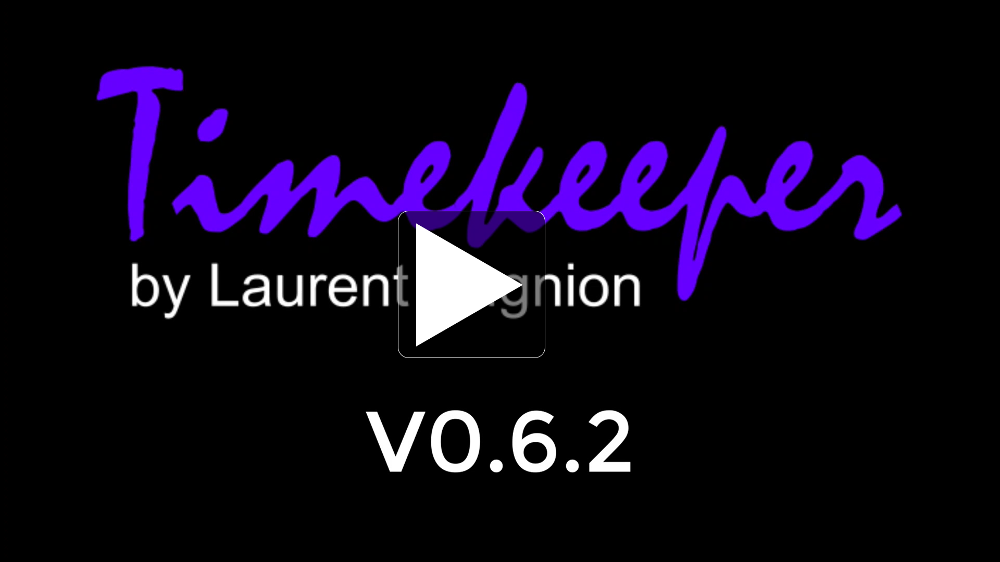

# Welcome to Timekeeper

[Timekeeper](http://timekeeper.cloud) is a utility developed by [Laurent Bugnion](http://twitter.com/lbugnion) to make it easier to keep track of time when working with guests online. Providing a dynamic display of timers, warnings, and text, it has been an essential tool for Hello World and beyond.

## History

Timekeeper was developed as a simple utility at first to help with remote recording of the [Humans of Microsoft segment](https://dev.to/search?q=humansofmicrosoft) for the [Hello World daily show on Microsoft LearnTV](https://aka.ms/learntv). It helps everyone on the recording (or on the live stream) to be aware of time, in real-time, without having to communicate in chat or without interrupting the guests while they are speaking.

## Features

After this first implementation, Timekeeper was extended to include additional functionalities.

> Thanks to the .NET Blazor technology, Timekeeper works on every platform (PC, Mac, iOS, Android) directly in your favorite web browser.

- Security: The host ("the timekeeper") must authenticate themselves to perform actions such as starting and stopping clocks, sending messages to the guests etc. This ensures that no one unauthorized can temper with the show.
- Multi-host: Multiple hosts can run the show. If one host loses the communication, another one can jump in and take over. This ensures that the show is not disrupted by technical issues.
- Multi sessions: The Timekeeper portal supports multiple sessions which can run independently from each other, and be prepared in advance.
- Multi clocks: Each session supports multiple clocks with different labels, running times, warnings, etc.
- Overtime warning: When a clock runs overtime, it will blink and display a custom message.
- Sending messages to the guests: We use this to send prompts during the stream, so that everyone can be notified of upcoming segments, technical issues, etc.
- Recovery: Everything is saved to a cloud session. If a host needs to restart their browser (or their PC), they can log in again in Timekeeper and continue working as if nothing happened.
- And more...

## Technology

Timekeeper is powered by Azure ([Azure Functions](https://docs.microsoft.com/azure/azure-functions/functions-overview), [Azure SignalR Service](https://docs.microsoft.com/azure/azure-signalr/), [Azure Static Web Apps](https://docs.microsoft.com/azure/static-web-apps/overview), [.NET Blazor](https://docs.microsoft.com/aspnet/core/blazor/?view=aspnetcore-5.0)), and is developed in the open at [http://github.com/lbugnion/timekeeper](http://github.com/lbugnion/timekeeper).

## For everyone, in the open

> The public version of Timekeeper is also available online at [http://timekeeper.cloud](http://timekeeper.cloud). Everyone can use this for their own online conferences, streams, podcasts etc.

A tutorial video is available:

After Timekeeper was developed and fine tuned for the Hello World daily show, other organizations and conferences have also adopted it:

- All Hands meeting for the Global Experiences team (Microsoft Developer Relations organization)
- [Global AI Student conference](https://aiconf.education/)
- [A Bit of AI](https://abitofai.show/) (show about AI with Amy Boyd and Henk Boelman)
- In discussion for other Channel 9 show.
